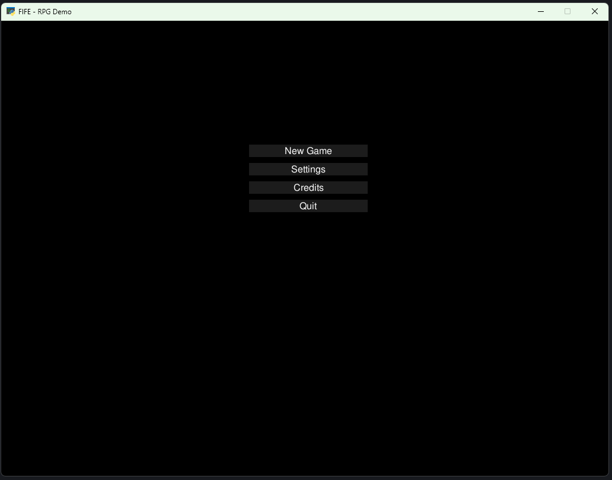
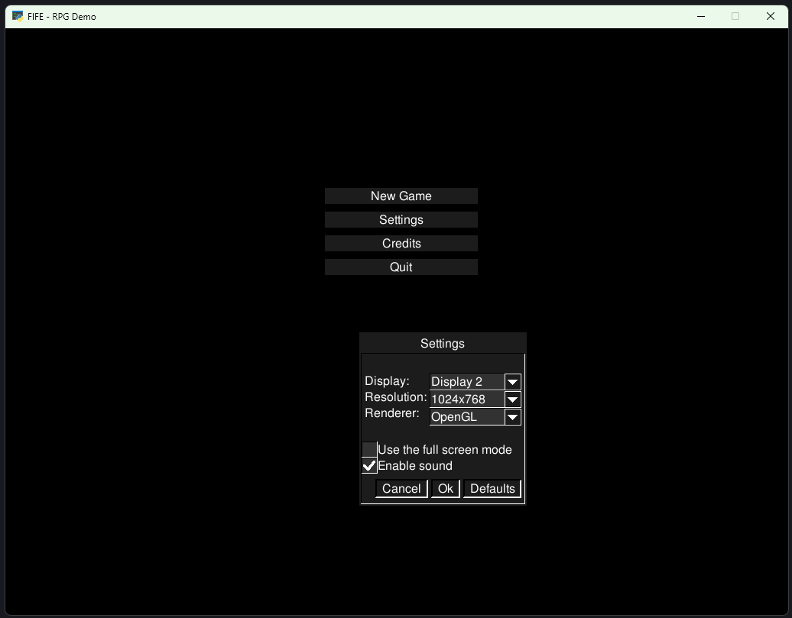
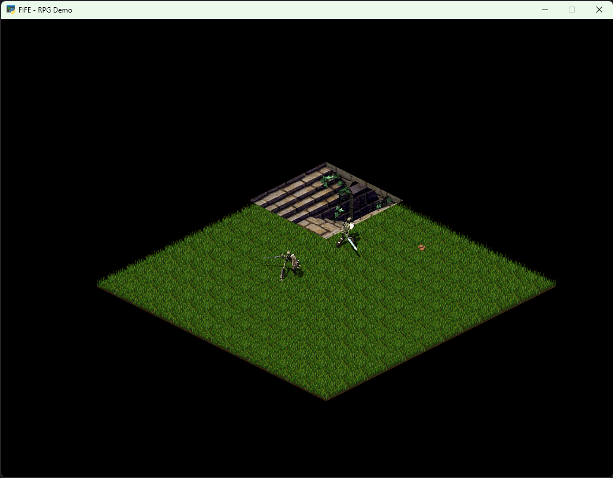

## Fifengine Demos 

This folder contains a number of demos that show off the features of FIFE.
They are meant to be used as examples and starting points for your own projects.
They are not meant to be complete games, but rather to show how to use the engine.

This folder has quick start scripts, which will will compile Fifengine
and run the demos. They are written for start within the Devcontainer
using the "clang20-x64-linux-rel" build preset.

You can also run the demos directly by running the `run.py` script in each demo's directory.

### CEGUI

The CEGUI demo shows, how to work with CrazyEddie's GUI.
The demo requires [PyCEGUI](http://cegui.org.uk/wiki/PyCEGUI).

To compile and start the application: `run_demo_cegui.sh`.
To just start the application: `cegui/run.py`.

### PyChan

The PyChan demo shows, how to work with the FifeGUI library.
Start the GUI demo application by running `run.py`.

### Rio De Hola

Rio de hola is a technology demo showing off many of the FIFE features.
It is located in the `<FIFE>/demos/rio_de_hola` directory and can be launched
by running `run.py`.

It was at one time meant to be an example game but we have moved away from
that idea and it is now more of a technology demo and a playground for
developers to test their code. It does serve as a good starting point
for people wishing to play around with FIFE or base your game off of.

### RPG

A basic RPG example.

The RPG demos is a simple RPG demo with a main menu, one level and a very basic
quest, where you contact a NPC and get a quest to find gold. You can then
travel to the mine and find the gold.

The demo is meant to show how to switch between different maps, how to use the
pathfinding and how to use the quest system.

It also shows how to use the GUI library to create a very simple main menu.

It is located in the `<FIFE>/demos/rpg` directory and can be launched by running `run.py`.

### Shooter

The Shooter demo was an attempt to show the versatility and flexibility of FIFE.
It is a simple side scrolling shooter with main menu, one level and an end boss.
Try your luck and see if you can defeat the boss!

### Configuring the Editor and Demos

The engine utilizes special settings files for configuring FIFE. This file is called `settings.xml` and resides in the `~/.fife directory` (in `<User>\Application Data\fife` for Windows users). The Shooter Demo and the PyChan demo are exceptions. They both store their `settings.xml` file in their root directories.

NOTE that the `settings.xml` file is auto generated and wont be there until you run the demos for the first time. FIFE automatically fills the settings file with default values. For more information on FIFE settings please see the manual: https://fifengine.github.io/fifengine-docs/developer-manual/en/#_engine_settings

### [Editor](https://github.com/fifengine/fifengine-editor)

The Python based editor tool can be found within the [fifengine-editor repo](https://github.com/fifengine/fifengine-editor).
You can launch it by running `run.py`.
It is used to edit map files for the [Rio De Hola demo](https://github.com/fifengine/fifengine-demos/tree/main/rio_de_hola).
Other clients extend it and use it to edit their maps.
